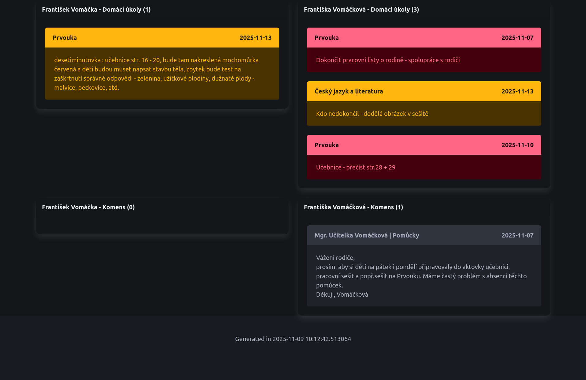

# Bakalari HTML Generator

This project is a Python-based tool designed to statically generate HTML pages by fetching data from the Bakalari API. It automates the process of retrieving information such as homework assignments and messages (komens) and then renders this data into user-friendly HTML summaries.

## Features

- Fetches homework assignments from the Bakalari API.
- Retrieves messages (komens) from the Bakalari API.
- Generates static HTML output for easy viewing and sharing.
- Customizable HTML templates using Jinja2.

## Developer Documentation

### Used Tools and Libraries

The project utilizes the following key Python libraries:

- **`requests`**: For making HTTP requests to the Bakalari API to authenticate and retrieve data.
- **`jinja2`**: A powerful templating engine used to render the fetched data into static HTML files.
- **`python-dateutil`**: Provides extensions to the standard `datetime` module, used for parsing and manipulating dates.

### Project Structure

- `main.py`: The main script that orchestrates data fetching, processing, and HTML generation.
- `templates/`: Contains Jinja2 HTML templates (`base.html`, `homeworks.html`, `komens.html`, `summary.html`) used for rendering the output.
- `logins.json.sample`: An example file demonstrating the structure for providing Bakalari login credentials.
- `pyproject.toml`: Project metadata and dependency management.

### Setup and Installation

1.  **Clone the repository:**
    ```bash
    git clone https://github.com/your-repo/bakalari-html-generator.git
    cd bakalari-html-generator
    ```

2.  **Install `uv` if it is not already installed:**
    ```bash
    curl -LsSf https://astral.sh/uv/install.sh | sh
    ```

3.  **Configure Bakalari API credentials:**
    Copy `logins.json.sample` to `logins.json` and fill in your Bakalari API base URL, username, and password.

    ```bash
    cp logins.json.sample logins.json
    # Edit logins.json with your credentials
    ```

### Usage

To generate the HTML summary, run the `main.py` script with your `logins.json` file as an argument:

```bash
uv run main.py logins.json > output.html
```

This will output the generated HTML to `stdout`, which is redirect to a file `output.html`.


### Sample

